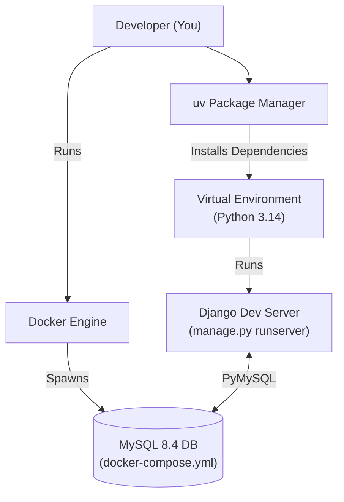

# Tech Stack Setup Guide

Welcome to the MetroDrip E-commerce repository! This guide provides everything you need to get the local development environment running seamlessly.

## 1. Complete Tech Stack List

| Layer | Technology | Version | Purpose |
|---|---|---|---|
| **Language** | Python | `>= 3.14` | Core programming language |
| **Framework** | Django | `5.2.x` | Backend web framework and ORM |
| **Database** | MySQL | `8.4.10` | Relational database (run via Docker) |
| **Package Manager** | uv | `latest` | High-speed Python package installer and resolver |
| **Database Driver** | PyMySQL | `latest` | Python client for MySQL |
| **Static Assets** | WhiteNoise | `6.x` | Serves collected static files in production/staging |
| **Background Jobs** | APScheduler | `latest` | In-process job scheduling (stock sweep/scan) |
| **Testing** | pytest, pytest-django | `8.4.2` | Test runner and Django integration |
| **Linting/Formatting** | Ruff | `latest` | Extremely fast Python linter and code formatter |
| **Containerization** | Docker & Compose | `latest` | Runs the local database and staging environment |

---

## 2. Setup Architecture Visualization

The following diagram illustrates how the tools connect during local development.



---

## 3. Beginner-Friendly Setup Instructions

Follow the steps for your operating system to set up the MetroDrip local environment.

### Prerequisites

Ensure you have **Git** and **Docker Desktop** (or Docker Engine) installed and running before starting.

### A. macOS & Linux

```bash
# 1. Install uv (if you haven't already)
curl -LsSf https://astral.sh/uv/install.sh | sh

# 2. Clone the repository and enter the directory
git clone https://github.com/SecretlySpy/TIP_MetroDrip-Ecommerce.git
cd TIP_MetroDrip-Ecommerce

# 3. Create a virtual environment and install dependencies
uv venv
source .venv/bin/activate
uv pip install -r requirements.txt

# 4. Start the local MySQL database using Docker
docker compose up -d

# 5. Set up the environment variables
cp .env.example .env

# 6. Apply database migrations and seed data
uv run manage.py migrate
uv run python seed_data.py
uv run python seed_more.py

# 7. Start the development server
uv run manage.py runserver
```

### B. Windows (PowerShell)

```powershell
# 1. Install uv (if you haven't already)
powershell -ExecutionPolicy ByPass -c "irm https://astral.sh/uv/install.ps1 | iex"

# 2. Clone the repository and enter the directory
git clone https://github.com/SecretlySpy/TIP_MetroDrip-Ecommerce.git
cd TIP_MetroDrip-Ecommerce

# 3. Create a virtual environment and install dependencies
uv venv
.venv\Scripts\activate
uv pip install -r requirements.txt

# 4. Start the local MySQL database using Docker
docker-compose up -d

# 5. Set up the environment variables
Copy-Item .env.example .env

# 6. Apply database migrations and seed data
uv run manage.py migrate
uv run python seed_data.py
uv run python seed_more.py

# 7. Start the development server
uv run manage.py runserver
```

---

## 4. Common Troubleshooting Tips

| Issue | Cause | Solution |
|---|---|---|
| **`MySQL server has gone away`** or Connection Refused | Docker container isn't running or finished initializing | Ensure Docker Desktop is running. Run `docker compose ps` to check if the database is up. If it's restarting, inspect logs with `docker compose logs`. |
| **Static files (CSS) missing** | `DEBUG=False` blocks static files unless collected | Run `uv run manage.py collectstatic --noinput`, then restart the server. Alternatively, change `DEBUG=True` in your `.env`. |
| **`No module named '...'`** | Virtual environment isn't activated | Ensure you've activated the virtual environment (`source .venv/bin/activate` or `.venv\Scripts\activate`) before running commands, or prefix commands with `uv run`. |
| **`django.db.utils.OperationalError: Unknown database`** | Database hasn't been created yet | Stop the container (`docker compose down -v`) and restart it (`docker compose up -d`). Give MySQL 15 seconds to initialize before running `migrate`. |
| **Test failures regarding caching** | `@cache_page` state leaking across tests | Ensure `config.settings.test` is being used (it overrides the cache backend to `DummyCache`). Run tests explicitly using `uv run pytest`. |

```text
+-------------------------------------------------+
| QUICK HEALTH CHECK ALGORITHM                    |
+-------------------------------------------------+
| 1. Is Docker running?                           |
|    -> No: Start Docker Desktop.                 |
|    -> Yes: Go to 2.                             |
| 2. Is 'uv' virtual environment active?          |
|    -> No: source .venv/bin/activate             |
|    -> Yes: Go to 3.                             |
| 3. Are migrations applied?                      |
|    -> No: uv run manage.py migrate              |
|    -> Yes: You are ready to code!               |
+-------------------------------------------------+
```
