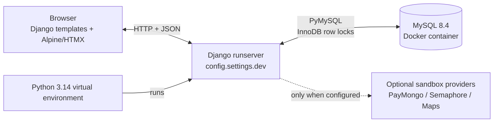
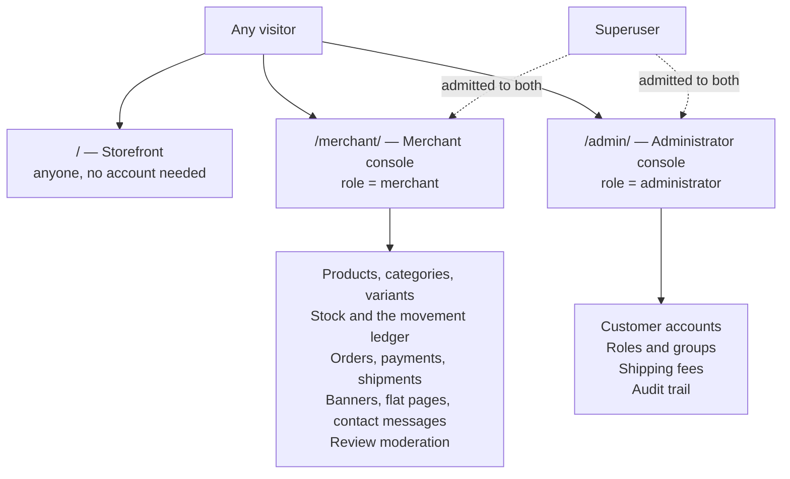
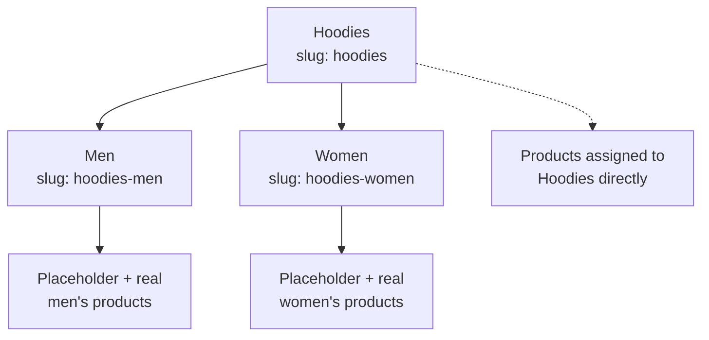
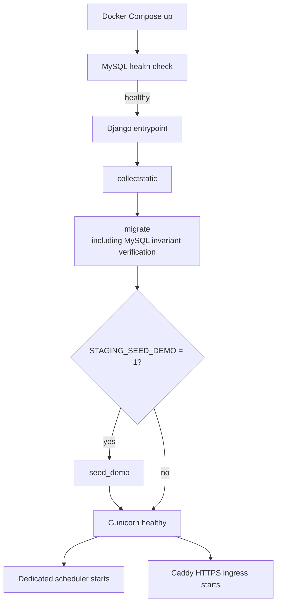

# MetroDrip Tech Stack Setup Guide

This guide sets up the current Django modular monolith for local development on macOS, Windows, or Linux. It uses the repository’s canonical `seed_demo` command and real MySQL/InnoDB behavior.

## 1. Supported stack

| Layer | Repository constraint | Cycle 1 verified version | Purpose |
|---|---:|---:|---|
| Python | `>=3.14` | `3.14.4` | Application runtime |
| Django | `~=5.2` (`>=5.2,<6.0`) | `5.2.16` | Web framework, ORM, auth, admin, templates |
| MySQL | Docker image `mysql:8.4` | `8.4.10` | Only supported database; InnoDB + `utf8mb4_0900_ai_ci` |
| PyMySQL | `~=1.1` (`>=1.1,<2.0`) | `1.2.0` | Pure-Python MySQL driver |
| APScheduler | `~=3.10` (`>=3.10,<4.0`) | `3.11.3` | Reservation sweep and low-stock jobs |
| python-dotenv | `~=1.0` (`>=1.0,<2.0`) | `1.2.2` | Loads local `.env` values |
| Gunicorn | `~=26.0` (`>=26,<27`) | `26.0.0` | Linux staging/production WSGI server |
| WhiteNoise | `~=6.12` (`>=6.12,<7.0`) | `6.12.0` | Collected static-file serving |
| Requests | `~=2.32` (`>=2.32,<3.0`) | `2.34.2` | PayMongo and Semaphore HTTP adapters |
| HTMX | Pinned CDN asset | `2.0.4` | Optional partial-page interactions |
| Alpine.js | Pinned CDN asset | `3.14.9` | Variant, cart, checkout, and badge behavior |
| pytest | `~=8.3` (`>=8.3,<9.0`) | `8.4.2` | Test runner |
| pytest-django | `~=4.9` (`>=4.9,<5.0`) | `4.12.0` | Django test integration |
| Ruff | `~=0.11` (`>=0.11,<1.0`) | `0.15.22` locally | Python linting and formatting |
| uv | No repository pin | `0.11.12` locally | Virtual environment and package installation |
| Docker Engine | Modern Docker with BuildKit | `28.5.1` locally | MySQL and staging containers |
| Docker Compose | Compose v2 plugin | `2.40.2` locally | Local/staging orchestration |
| Caddy | Docker image `caddy:2-alpine` | Major line `2` | HTTPS ingress and reverse proxy |

> `uv.lock` currently contains only the Python requirement metadata; it is not a resolved package lock. `requirements.txt` uses compatible-release ranges, so a new installation may select newer compatible patch/minor versions. Run the full QA gate after a fresh resolve.

Node.js and npm are not required: storefront JavaScript is served directly, and HTMX/Alpine are loaded from pinned CDN URLs.

## 2. Local-development architecture


```mermaid
flowchart LR
    Browser["Browser\nDjango templates + Alpine/HTMX"]
    Python["Python 3.14 virtual environment"]
    Django["Django runserver\nconfig.settings.dev"]
    MySQL[("MySQL 8.4\nDocker container")]
    Providers["Optional sandbox providers\nPayMongo / Semaphore / Maps"]

    Browser <-->|HTTP + JSON| Django
    Python -->|runs| Django
    Django <-->|PyMySQL\nInnoDB row locks| MySQL
    Django -.->|only when configured| Providers
```

The browser cart is stored under `localStorage["metrodrip_cart"]`. Client prices and availability are display hints; checkout reloads authoritative variants, prices, and stock from MySQL.

### The three front doors

One Django project serves three audiences at three paths. Knowing which one you
want saves a lot of confusion when a login "does not work" — it usually did
work, at the wrong door.


```mermaid
flowchart TD
    Visitor["Any visitor"]
    Visitor --> Shop["/ — Storefront<br/>anyone, no account needed"]
    Visitor --> Merch["/merchant/ — Merchant console<br/>role = merchant"]
    Visitor --> Adm["/admin/ — Administrator console<br/>role = administrator"]

    Merch --> MerchOwns["Products, categories, variants<br/>Stock and the movement ledger<br/>Orders, payments, shipments<br/>Banners, flat pages, contact messages<br/>Review moderation"]
    Adm --> AdmOwns["Customer accounts<br/>Roles and groups<br/>Shipping fees<br/>Audit trail"]

    Super["Superuser"] -.->|admitted to both| Merch
    Super -.->|admitted to both| Adm
```

Signing in to the wrong console does not fail silently: the page tells you which
console your account belongs to and links to it. A merchant who guesses an
administrator URL gets a plain **404**, because that model is not registered on
their console at all — the URL was never routed there.

| | Storefront | Merchant console | Administrator console |
|---|---|---|---|
| **Path** | `/` | `/merchant/` | `/admin/` |
| **Who** | anyone | `role = merchant` + staff | `role = administrator` + staff |
| **Sells things** | buys | yes | no |
| **Sees customer records** | own only | **no** | yes |
| **Sees the audit trail** | no | no | yes |
| **Sets shipping fees** | no | no | yes |
| **Prints invoices** | no | yes | no |

## 3. Prerequisites

Install these before cloning:

- Git
- Python 3.14
- uv
- Docker Desktop on macOS/Windows, or Docker Engine plus the Compose v2 plugin on Linux

Confirm the tools:

```text
python --version       -> Python 3.14.x
uv --version
docker --version
docker compose version -> Docker Compose version v2.x
```

Docker must be running, not merely installed.

## 4. macOS setup

Open Terminal:

```bash
# Install uv if it is not already available.
curl -LsSf https://astral.sh/uv/install.sh | sh

# Clone and enter the repository.
git clone https://github.com/SecretlySpy/TIP_MetroDrip-Ecommerce.git
cd TIP_MetroDrip-Ecommerce

# Create the Python 3.14 environment and install repository requirements.
uv venv .venv --python 3.14
uv pip install --python .venv/bin/python -r requirements.txt

# Create the untracked local environment file.
cp .env.example .env

# Start only the local MySQL service and wait for its health check.
docker compose up -d db --wait

# Apply schema migrations and load the canonical idempotent demo.
.venv/bin/python manage.py migrate
.venv/bin/python manage.py seed_demo

# Start Django at http://127.0.0.1:8000/.
.venv/bin/python manage.py runserver
```

Docker Desktop must be open before `docker compose up`.

## 5. Windows setup

Open PowerShell:

```powershell
# Install uv if it is not already available.
powershell -ExecutionPolicy ByPass -c "irm https://astral.sh/uv/install.ps1 | iex"

# Clone and enter the repository.
git clone https://github.com/SecretlySpy/TIP_MetroDrip-Ecommerce.git
Set-Location TIP_MetroDrip-Ecommerce

# Create the Python 3.14 environment and install requirements without relying on pip inside it.
uv venv .venv --python 3.14
uv pip install --python .venv\Scripts\python.exe -r requirements.txt

# Create the untracked local environment file.
Copy-Item .env.example .env

# Start only MySQL and wait for it to become healthy.
docker compose up -d db --wait

# Apply schema migrations and load the canonical idempotent demo.
.\.venv\Scripts\python.exe manage.py migrate
.\.venv\Scripts\python.exe manage.py seed_demo

# Start Django at http://127.0.0.1:8000/.
.\.venv\Scripts\python.exe manage.py runserver
```

Using `uv pip install --python ...` is intentional. A uv-created `.venv` may not contain its own `pip` module.

## 6. Linux setup

Install Git, Python 3.14, Docker Engine, and the Docker Compose v2 plugin using your distribution’s supported packages. Configure Docker so your user can run the verified `docker` command; do not mix root-owned and user-owned project files.

Then run:

```bash
# Install uv if it is not already available.
curl -LsSf https://astral.sh/uv/install.sh | sh

# Clone and enter the repository.
git clone https://github.com/SecretlySpy/TIP_MetroDrip-Ecommerce.git
cd TIP_MetroDrip-Ecommerce

# Create the Python environment and install dependencies.
uv venv .venv --python 3.14
uv pip install --python .venv/bin/python -r requirements.txt

# Configure local values, start MySQL, migrate, and seed.
cp .env.example .env
docker compose up -d db --wait
.venv/bin/python manage.py migrate
.venv/bin/python manage.py seed_demo

# Start Django.
.venv/bin/python manage.py runserver
```

## 7. What setup creates

`seed_demo` is atomic and safe to rerun. On an empty database it creates:

| Data | Count |
|---|---:|
| Categories | 5 |
| Products | 5 |
| Product variants | 180 |
| Stock records | 180 |
| Initial restock movements | 180 |
| Shipping zones | 3 |
| Flatpages | 3 |
| Homepage banners | 1 |

Rerunning updates stable catalog metadata but does not reset existing stock or duplicate the initial stock ledger.

### Creating console accounts

`seed_demo` creates catalog data, not staff. Make the accounts yourself, and
make **two** of them — one per console — or you will not be able to see that the
separation works.

```bash
# 1. Grant the two console groups their permissions.
#    Run this after every migrate, and after any change to which console owns a
#    model. It derives the grants from the consoles themselves.
python manage.py sync_console_roles

# 2. A merchant. Note: staff, but NOT a superuser.
python manage.py create_console_account --role merchant \
    --email seller@metrodrip.test --name "Demo Seller"

# 3. An administrator.
python manage.py create_console_account --role administrator \
    --email ops@metrodrip.test --name "Demo Administrator"

# 4. Give the new accounts their group permissions.
python manage.py sync_console_roles
```

Each command prompts for a password, or reads `METRODRIP_CONSOLE_PASSWORD`, or
takes `--password`. Passwords go through Django's normal validators, so
`password123` is rejected here exactly as it would be for a shopper.

> **Do not use `createsuperuser` for this.** A superuser is admitted to *both*
> consoles, so testing with one proves nothing about the separation. Keep a
> superuser for recovery and use scoped accounts for everything else.

Re-running `create_console_account` with an existing email changes that
account's role without touching its password, which makes it easy to watch an
account move between consoles.

**If a console looks completely empty after signing in**, you skipped step 4.
The role gets you through the door; the group permissions decide what is in the
room. Run `sync_console_roles` and reload — do not "fix" it by granting
superuser, which removes the boundary entirely.

### Category hierarchy

Categories are two levels deep: main categories such as **Hoodies**, each with **Men** and **Women** subcategories. Migration `catalog.0003_category_hierarchy` adds those children to whatever main categories a database already holds, and `seed_mock_catalog` re-establishes them for any added later.

Child slugs are parent-prefixed (`hoodies-men`) because `Category.name` is intentionally not unique — "Men" has to exist under every parent. The slug is the only globally unique identifier.


```mermaid
flowchart TD
    Root["Hoodies<br/>slug: hoodies"]
    Men["Men<br/>slug: hoodies-men"]
    Women["Women<br/>slug: hoodies-women"]
    Legacy["Products assigned to<br/>Hoodies directly"]
    PM["Placeholder + real<br/>men's products"]
    PW["Placeholder + real<br/>women's products"]

    Root --> Men
    Root --> Women
    Root -.-> Legacy
    Men --> PM
    Women --> PW
```

A third level is rejected by model validation, and a category cannot become its own parent. Neither rule is a database constraint: depth needs a join, and MySQL refuses a CHECK constraint that references an AUTO_INCREMENT column.

Filtering follows the branch:

| Link | Returns |
|---|---|
| `/shop/?category=hoodies` | products on **Hoodies** itself plus everything in its subcategories |
| `/shop/?category=hoodies-men` | only products assigned to **Hoodies → Men** |

### Filling the catalog for browsing tests

A five-product catalog cannot exercise pagination or a category menu. `seed_mock_catalog` adds deterministic placeholders alongside the demo data, without touching the `seed_demo` contract above:

```bash
# Preview the plan; writes nothing.
python manage.py seed_mock_catalog --dry-run

# Create 100 placeholders spread evenly across every subcategory.
python manage.py seed_mock_catalog

# Any other target works too.
python manage.py seed_mock_catalog --count 40
```

| Behaviour | Detail |
|---|---|
| `--count` | Number of **placeholders** to maintain, not the total catalog size. A database with 12 real products ends with 112. |
| Distribution | Round-robin across every subcategory. 100 over 18 leaves gives ten leaves 6 products and eight leaves 5. |
| Rerun | Creates nothing. Slugs derive from (category, audience, sequence), so a second run resolves to rows that already exist. |
| Existing stock | Never reset. Quantities, reservations, and thresholds are left exactly as found. |
| Over target | Reported as a warning. The command has no delete path. |
| Identification | Placeholders carry `is_mock=True` and are filterable in Django Admin. They are ordinary active products otherwise. |

## 8. Optional scheduler

Checkout reservations expire through the dedicated scheduler process. In a second terminal:

```bash
# macOS/Linux
.venv/bin/python manage.py run_scheduler
```

```powershell
# Windows
.\.venv\Scripts\python.exe manage.py run_scheduler
```

Run exactly one scheduler per environment. Duplicate schedulers waste locks and can duplicate low-stock alerts.

## 9. Full local QA

MySQL must be healthy before the full test suite.

### macOS/Linux

```bash
.venv/bin/python -m compileall -q apps config jobs tests manage.py
.venv/bin/ruff check .
.venv/bin/ruff format --check .
uv pip check --python .venv/bin/python
.venv/bin/python manage.py check
.venv/bin/python manage.py makemigrations --check --dry-run
.venv/bin/python -m pytest
docker compose config --quiet
docker compose --env-file deploy/.env.staging.example -f deploy/compose.staging.yml config --quiet
docker build --check .
```

### Windows PowerShell

```powershell
.\.venv\Scripts\python.exe -m compileall -q apps config jobs tests manage.py
.\.venv\Scripts\ruff.exe check .
.\.venv\Scripts\ruff.exe format --check .
uv pip check --python .venv\Scripts\python.exe
.\.venv\Scripts\python.exe manage.py check
.\.venv\Scripts\python.exe manage.py makemigrations --check --dry-run
.\.venv\Scripts\python.exe -m pytest
docker compose config --quiet
docker compose --env-file deploy/.env.staging.example -f deploy/compose.staging.yml config --quiet
docker build --check .
```

Cycle 2 evidence is 388 passing tests against real MySQL. SQLite is unsupported because it cannot prove the InnoDB row-locking contracts.

## 10. Staging startup flow


```mermaid
flowchart TD
    Compose["Docker Compose up"]
    DB["MySQL health check"]
    Entrypoint["Django entrypoint"]
    Static["collectstatic"]
    Migrate["migrate\nincluding MySQL invariant verification"]
    Seed{"STAGING_SEED_DEMO = 1?"}
    SeedRun["seed_demo"]
    Gunicorn["Gunicorn healthy"]
    Scheduler["Dedicated scheduler starts"]
    Caddy["Caddy HTTPS ingress starts"]

    Compose --> DB
    DB -->|healthy| Entrypoint
    Entrypoint --> Static --> Migrate --> Seed
    Seed -->|yes| SeedRun --> Gunicorn
    Seed -->|no| Gunicorn
    Gunicorn --> Scheduler
    Gunicorn --> Caddy
```

To prepare staging:

```bash
cp deploy/.env.staging.example deploy/.env.staging
chmod 600 deploy/.env.staging
```

Replace every placeholder with real values, then validate before starting:

```bash
docker compose --env-file deploy/.env.staging -f deploy/compose.staging.yml config --quiet
docker compose --env-file deploy/.env.staging -f deploy/compose.staging.yml up -d --build --wait
```

Windows can use `Copy-Item` instead of `cp`; file-permission hardening applies on the Linux deployment host.

Local HTTPS tests using a locally trusted/self-signed certificate prove container integration only. A public completion claim additionally requires an authorized host, DNS pointing to it, reachable ports 80/443, a publicly trusted certificate, external smoke tests, and backup/restore evidence. See `deploy/README.md`.

## 11. Environment-variable map

| Variable | Local default | Staging requirement |
|---|---|---|
| `DJANGO_SECRET_KEY` | Development placeholder | Strong unique value, at least 50 characters/five distinct |
| `MYSQL_DATABASE` | `metrodrip` | Required |
| `MYSQL_USER` | `metrodrip` | Required |
| `MYSQL_PASSWORD` | `metrodrip` | Strong value, at least 16 characters/five distinct |
| `MYSQL_HOST` | `127.0.0.1` | Compose fixes `db` |
| `MYSQL_PORT` | `3306` | Valid port; Compose fixes `3306` |
| `PAYMONGO_SECRET_KEY` | Empty; enables dev mock | Real sandbox/live secret when exercising provider flow |
| `PAYMONGO_WEBHOOK_SECRET` | Empty | Required before accepting provider webhooks |
| `SEMAPHORE_API_KEY` | Empty; SMS logs only | Optional provider credential |
| `GOOGLE_MAPS_API_KEY` | Empty | Optional Places autocomplete credential |
| `LOW_STOCK_ALERT_RECIPIENTS` | Empty | Optional comma-separated staff email list |
| `CONTACT_ALERT_RECIPIENTS` | Empty | Optional comma-separated staff email list |
| `STAGING_HOST` | Not used | Must match allowed hosts and CSRF-origin hostname |
| `METRODRIP_CONSOLE_PASSWORD` | Empty; `create_console_account` prompts | Only read by that command; never a runtime setting |
| `STAGING_SEED_DEMO` | Not used | Exact `0` or `1` |
| `STAGING_SEED_PREVIEW_ENABLED` | False | Exact `0` or `1` |

Never commit `.env`, `deploy/.env.staging`, provider secrets, database dumps, or real customer data.

## 12. Troubleshooting

| Symptom | Likely cause | Fix |
|---|---|---|
| `Cannot connect to the Docker daemon` or missing Desktop Linux pipe | Docker engine is stopped | Start Docker Desktop/Engine, wait for it to report ready, then run `docker info`. |
| MySQL connection refused on `127.0.0.1:3306` | Database container is stopped or initializing | Run `docker compose up -d db --wait`, then `docker compose ps` and `docker compose logs db`. |
| Port `3306` is already allocated | Another MySQL/service owns the port | Stop the conflicting service or deliberately change both the Compose mapping and `.env` port. |
| `.venv` reports `No module named pip` | uv created an environment without bundled pip | Use `uv pip install --python <venv-python> ...` and `uv pip check --python <venv-python>`. |
| `Access denied` while pytest creates `test_metrodrip` | An older persistent volume predates `docker/mysql-init.sql` grants | Back up anything important first. Recreate only the local development volume or grant the documented test-database privileges manually. |
| Migration reports non-MySQL backend or failed InnoDB/charset enforcement | Wrong database, old MySQL, or insufficient ALTER privileges | Use the provided MySQL 8.4 service and ensure the migration user can alter its own database/tables. |
| `Unknown database metrodrip` | Container initialization did not finish or `.env` differs from Compose | Compare `.env` with `.env.example`, inspect DB logs, and restart the DB after correcting values. |
| CSS/static files fail in staging | `collectstatic`, manifest, or volume permissions failed | Inspect app startup logs and confirm `/app/staticfiles` belongs to UID/GID `10001`. |
| Pages seem to reuse another test’s homepage data | Wrong test settings/cache backend | Run pytest normally so `config.settings.test` selects DummyCache. |
| Public HTTPS fails while local `curl -k` works | DNS, firewall, port forwarding, or ACME is not proven | Verify public DNS and inbound TCP 80/443 from an external network; inspect Caddy logs. |
| A migration/test appears stuck | Row-lock contention or another test process is using MySQL | Stop duplicate pytest/scheduler processes, inspect MySQL sessions, then rerun one suite. |
| CI fails at *Verify image identity and ownership boundaries* but the image builds fine locally | A file lost its executable bit in the Git tree. Windows cannot store POSIX mode bits, and Docker Desktop's Windows build context reports `0755` for everything, so the defect is invisible on Windows | Check the recorded mode with `git ls-files -s manage.py deploy/entrypoint.sh` — both must be `100755`. Restore with `git update-index --chmod=+x <file>`. See the reproduction recipe below. |

### Reproducing a Linux-runner file mode from Windows

Docker's Windows build context masks mode defects. Build from `git archive` instead — it emits the modes recorded in the Git tree, exactly what `actions/checkout` produces on a Linux runner.

```bash
git archive HEAD -o before.tar
tar -tvf before.tar manage.py          # shows the mode CI will actually see
docker build --tag metrodrip-check - < before.tar
docker run --rm --entrypoint /usr/bin/stat metrodrip-check \
  -c '%n mode=%a owner=%u:%g' /app/manage.py /app/deploy/entrypoint.sh /app/staticfiles
```

Expected: `manage.py` and `entrypoint.sh` at `mode=755 owner=0:0`, `staticfiles` at `mode=755 owner=10001:10001`.

### Local data reset warning

`docker compose down -v` deletes the local MySQL named volume and all local database data. Use it only after confirming the exact project and backing up anything you need. Ordinary `docker compose down` keeps the volume.

## 13. Quick health checklist

```text
[ ] Python reports 3.14.x
[ ] Docker engine is running
[ ] docker compose ps shows metrodrip-mysql healthy
[ ] .env exists and is not tracked by Git
[ ] manage.py migrate completes
[ ] manage.py seed_demo completes
[ ] manage.py check reports no issues
[ ] manage.py sync_console_roles reports both groups
[ ] pytest passes against MySQL
[ ] http://127.0.0.1:8000/ renders the banner and catalog
[ ] /merchant/login/ says "Merchant Login"
[ ] /admin/login/ says "Administrator Login"
[ ] the merchant account signs in to /merchant/ and sees Products
[ ] the same account at /admin/ is told it is on the wrong console
```
