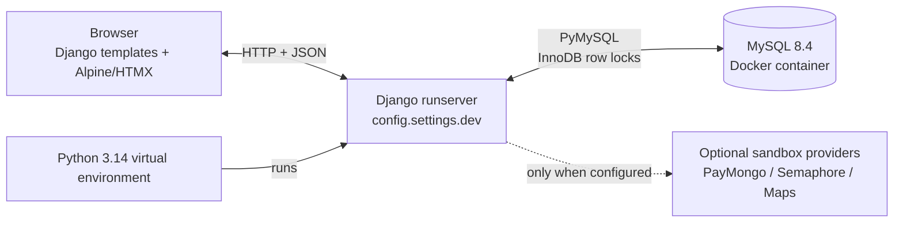
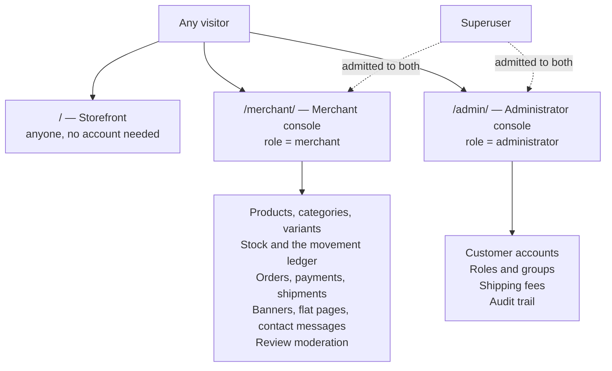
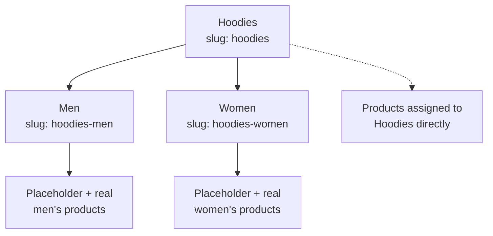
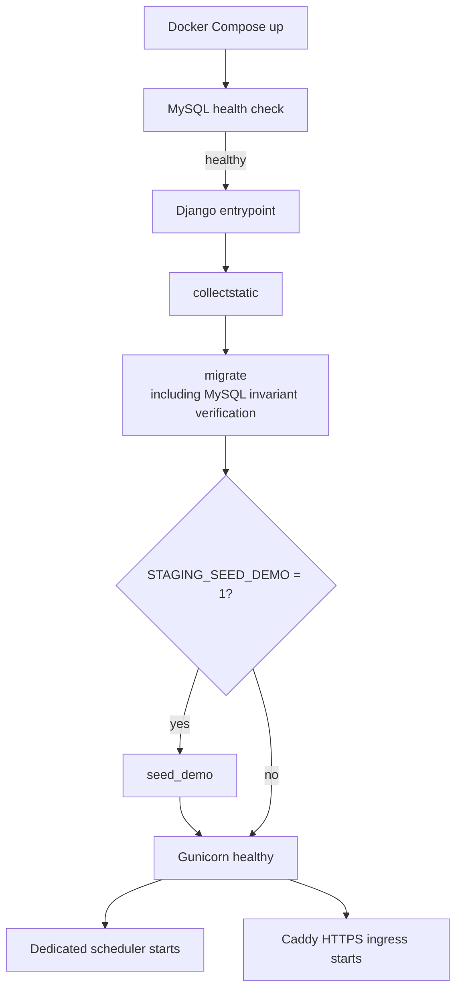

# MetroDrip Tech Stack Setup Guide

This guide sets up the current Django modular monolith for local development on macOS, Windows, or Linux. It uses the repository’s canonical `seed_demo` command and real MySQL/InnoDB behavior.

A shorter, illustrated version of the same path is published at
<https://secretlyspy.github.io/TIP_MetroDrip-Ecommerce/> (source: `index.html`). That page is the
beginner-facing route, with screenshots and per-OS command switching; this file is the reference,
with the full version table, the environment-variable map, and the staging flow. Sections 14 and 15
below mirror Steps 8 and 11-13 of that page — keep the two in step when either changes.

## 1. Supported stack

| Layer | Repository constraint | Verified locally 2026-08-24 | Purpose |
|---|---:|---:|---|
| Python | `>=3.14` | `3.14.6` | Application runtime |
| Django | `~=5.2` (`>=5.2,<6.0`) | `5.2.16` | Web framework, ORM, auth, admin, templates |
| MySQL | Docker image `mysql:8.4` | `8.4.10` | Only supported database; InnoDB + `utf8mb4_0900_ai_ci` |
| PyMySQL | `~=1.1` (`>=1.1,<2.0`) | `1.2.0` | Pure-Python MySQL driver |
| APScheduler | `~=3.10` (`>=3.10,<4.0`) | `3.11.3` | Reservation sweep and low-stock jobs |
| python-dotenv | `~=1.0` (`>=1.0,<2.0`) | `1.2.2` | Loads local `.env` values |
| Gunicorn | `~=26.0` (`>=26,<27`) | `26.0.0` | Linux staging/production WSGI server |
| WhiteNoise | `~=6.12` (`>=6.12,<7.0`) | `6.12.0` | Collected static-file serving |
| Requests | `~=2.32` (`>=2.32,<3.0`) | `2.34.2` | PayMongo and Semaphore HTTP adapters |
| HTMX | Pinned CDN asset | `2.0.4` | Optional partial-page interactions |
| Alpine.js | Pinned CDN asset | `3.14.9` | Variant, cart, checkout, and badge behavior |
| pytest | `~=8.3` (`>=8.3,<9.0`) | `8.4.2` | Test runner |
| pytest-django | `~=4.9` (`>=4.9,<5.0`) | `4.12.0` | Django test integration |
| Ruff | `~=0.11` (`>=0.11,<1.0`) | `0.16.1` locally | Python linting and formatting |
| uv | No repository pin | `0.12.1` locally | Virtual environment and package installation |
| Docker Engine | Modern Docker with BuildKit | `29.7.2` locally | MySQL and staging containers |
| Docker Compose | Compose v2 plugin | `2.40.3` locally | Local/staging orchestration |
| Caddy | Docker image `caddy:2-alpine` | Major line `2` | HTTPS ingress and reverse proxy |

> `uv.lock` currently contains only the Python requirement metadata; it is not a resolved package lock. `requirements.txt` uses compatible-release ranges, so a new installation may select newer compatible patch/minor versions. Run the full QA gate after a fresh resolve.

Node.js 22.13+ and npm are required for the Expo 57 / React Native 0.86 customer app under
`mobile/`. Storefront web JavaScript is server-rendered with HTMX and Alpine.js loaded from pinned
CDN URLs.

## 2. Local-development architecture


```mermaid
flowchart LR
    Browser["Browser\nDjango templates + Alpine/HTMX"]
    Python["Python 3.14 virtual environment"]
    Django["Django runserver\nconfig.settings.dev"]
    MySQL[("MySQL 8.4\nDocker container")]
    Providers["Optional sandbox providers\nPayMongo / Semaphore / Maps"]

    Browser <-->|HTTP + JSON| Django
    Python -->|runs| Django
    Django <-->|PyMySQL\nInnoDB row locks| MySQL
    Django -.->|only when configured| Providers
```

The browser cart is stored under `localStorage["metrodrip_cart"]`. Client prices and availability are display hints; checkout reloads authoritative variants, prices, and stock from MySQL.

### The three front doors

One Django project serves three audiences at three paths. Knowing which one you
want saves a lot of confusion when a login "does not work" — it usually did
work, at the wrong door.


```mermaid
flowchart TD
    Visitor["Any visitor"]
    Visitor --> Shop["/ — Storefront<br/>anyone, no account needed"]
    Visitor --> Merch["/merchant/ — Merchant console<br/>role = merchant"]
    Visitor --> Adm["/admin/ — Administrator console<br/>role = administrator"]

    Merch --> MerchOwns["Products, categories, variants<br/>Stock and the movement ledger<br/>Orders, payments, shipments<br/>Banners, flat pages, contact messages<br/>Review moderation"]
    Adm --> AdmOwns["Customer accounts<br/>Roles and groups<br/>Shipping fees<br/>Audit trail"]

    Super["Superuser"] -.->|admitted to both| Merch
    Super -.->|admitted to both| Adm
```

Signing in to the wrong console does not fail silently: the page tells you which
console your account belongs to and links to it. A merchant who guesses an
administrator URL gets a plain **404**, because that model is not registered on
their console at all — the URL was never routed there.

| | Storefront | Merchant console | Administrator console |
|---|---|---|---|
| **Path** | `/` | `/merchant/` | `/admin/` |
| **Who** | anyone | `role = merchant` + staff | `role = administrator` + staff |
| **Sells things** | buys | yes | no |
| **Sees customer records** | own only | **no** | yes |
| **Sees the audit trail** | no | no | yes |
| **Sets shipping fees** | no | no | yes |
| **Prints invoices** | no | yes | no |

## 3. Prerequisites

Install these before cloning:

- Git
- Python 3.14
- uv
- Docker Desktop on macOS/Windows, or Docker Engine plus the Compose v2 plugin on Linux

Required only for the mobile app (section 14), and safely skipped otherwise:

- Node.js 22.13+ and npm
- For an Android build: JDK 17 and Android platform/build tools plus a Google APIs API 36 image
- For an iOS build: macOS with Xcode 26.4+ / the iOS 26 SDK — there is no Windows or Linux path

Confirm the tools:

```text
python --version       -> Python 3.14.x
uv --version
docker --version
docker compose version -> Docker Compose version v2.x
```

Docker must be running, not merely installed.

## 4. macOS setup

Open Terminal:

```bash
# Install uv if it is not already available.
curl -LsSf https://astral.sh/uv/install.sh | sh

# Clone and enter the repository.
git clone https://github.com/SecretlySpy/TIP_MetroDrip-Ecommerce.git
cd TIP_MetroDrip-Ecommerce

# Create the Python 3.14 environment and install repository requirements.
uv venv .venv --python 3.14
uv pip install --python .venv/bin/python -r requirements.txt

# Create the untracked local environment file.
cp .env.example .env

# Start MySQL and Redis and wait for their health checks.
docker compose up -d db redis --wait

# Apply schema migrations and load the canonical idempotent demo.
.venv/bin/python manage.py migrate
.venv/bin/python manage.py seed_demo

# Start Django at http://127.0.0.1:8000/.
.venv/bin/python manage.py runserver
```

Docker Desktop must be open before `docker compose up`.

## 5. Windows setup

Open PowerShell:

```powershell
# Install uv if it is not already available.
powershell -ExecutionPolicy ByPass -c "irm https://astral.sh/uv/install.ps1 | iex"

# Clone and enter the repository.
git clone https://github.com/SecretlySpy/TIP_MetroDrip-Ecommerce.git
Set-Location TIP_MetroDrip-Ecommerce

# Create the Python 3.14 environment and install requirements without relying on pip inside it.
uv venv .venv --python 3.14
uv pip install --python .venv\Scripts\python.exe -r requirements.txt

# Create the untracked local environment file.
Copy-Item .env.example .env

# Start MySQL and Redis and wait for both to become healthy.
docker compose up -d db redis --wait

# Apply schema migrations and load the canonical idempotent demo.
.\.venv\Scripts\python.exe manage.py migrate
.\.venv\Scripts\python.exe manage.py seed_demo

# Start Django at http://127.0.0.1:8000/.
.\.venv\Scripts\python.exe manage.py runserver
```

Using `uv pip install --python ...` is intentional. A uv-created `.venv` may not contain its own `pip` module.

## 6. Linux setup

Install Git, Python 3.14, Docker Engine, and the Docker Compose v2 plugin using your distribution’s supported packages. Configure Docker so your user can run the verified `docker` command; do not mix root-owned and user-owned project files.

Then run:

```bash
# Install uv if it is not already available.
curl -LsSf https://astral.sh/uv/install.sh | sh

# Clone and enter the repository.
git clone https://github.com/SecretlySpy/TIP_MetroDrip-Ecommerce.git
cd TIP_MetroDrip-Ecommerce

# Create the Python environment and install dependencies.
uv venv .venv --python 3.14
uv pip install --python .venv/bin/python -r requirements.txt

# Configure local values, start MySQL, migrate, and seed.
cp .env.example .env
docker compose up -d db redis --wait
.venv/bin/python manage.py migrate
.venv/bin/python manage.py seed_demo

# Start Django.
.venv/bin/python manage.py runserver
```

## 7. What setup creates

`seed_demo` is atomic and safe to rerun. On an empty database it creates:

| Data | Count |
|---|---:|
| Categories | 5 |
| Products | 5 |
| Product variants | 180 |
| Stock records | 180 |
| Initial restock movements | 180 |
| Shipping zones | 3 |
| Flatpages | 3 |
| Homepage banners | 1 |

Rerunning updates stable catalog metadata but does not reset existing stock or duplicate the initial
stock ledger. The command leaves each product's `images` list empty and creates only five root
categories; product imagery and Men/Women children are not part of this canonical seed.

### Creating console accounts

`seed_demo` creates catalog data, not staff. Make the accounts yourself, and
make **two** of them — one per console — or you will not be able to see that the
separation works.

```bash
# 1. Grant the two console groups their permissions.
#    Run this after every migrate, and after any change to which console owns a
#    model. It derives the grants from the consoles themselves.
python manage.py sync_console_roles

# 2. A merchant. Note: staff, but NOT a superuser.
python manage.py create_console_account --role merchant \
    --email seller@metrodrip.test --name "Demo Seller"

# 3. An administrator.
python manage.py create_console_account --role administrator \
    --email ops@metrodrip.test --name "Demo Administrator"

# 4. Give the new accounts their group permissions.
python manage.py sync_console_roles
```

Each command prompts for a password, or reads `METRODRIP_CONSOLE_PASSWORD`, or
takes `--password`. Passwords go through Django's normal validators, so
`password123` is rejected here exactly as it would be for a shopper.

> **Do not use `createsuperuser` for this.** A superuser is admitted to *both*
> consoles, so testing with one proves nothing about the separation. Keep a
> superuser for recovery and use scoped accounts for everything else.

Re-running `create_console_account` with an existing email changes that
account's role without touching its password, which makes it easy to watch an
account move between consoles.

**If a console looks completely empty after signing in**, you skipped step 4.
The role gets you through the door; the group permissions decide what is in the
room. Run `sync_console_roles` and reload — do not "fix" it by granting
superuser, which removes the boundary entirely.

### Console sign-in and colour theme

The Merchant and Administrator sign-in pages share one responsive, accessible
shell but retain their own role name, route, and purpose. They do not expose a
staff sign-up link: create staff only through the provisioned-account commands
above. On the login page, select **Light** or **Dark** in the Theme control.
After login, the same two-state control appears at the bottom of the sidebar.
The explicit choice is stored in the browser under the same `theme` preference
used by the storefront; until a choice is made, the operating-system preference
is used. Keyboard focus uses a dual-contrast ring, and the complete login flow
reflows at phone widths without page-level horizontal scrolling.

### Category hierarchy

Categories support two levels: main categories such as **Hoodies** may have **Men** and **Women**
subcategories. Migration `catalog.0003_category_hierarchy` added children only to categories present
when that migration ran. A normal fresh install migrates before seeding, so `seed_demo` creates five
root categories with no children. `seed_mock_catalog` deliberately creates/re-establishes Men/Women
children for every root when filter and pagination fixtures are needed.

Child slugs are parent-prefixed (`hoodies-men`) because `Category.name` is intentionally not unique — "Men" has to exist under every parent. The slug is the only globally unique identifier.


```mermaid
flowchart TD
    Root["Hoodies<br/>slug: hoodies"]
    Men["Men<br/>slug: hoodies-men"]
    Women["Women<br/>slug: hoodies-women"]
    Legacy["Products assigned to<br/>Hoodies directly"]
    PM["Placeholder + real<br/>men's products"]
    PW["Placeholder + real<br/>women's products"]

    Root --> Men
    Root --> Women
    Root -.-> Legacy
    Men --> PM
    Women --> PW
```

A third level is rejected by model validation, and a category cannot become its own parent. Neither rule is a database constraint: depth needs a join, and MySQL refuses a CHECK constraint that references an AUTO_INCREMENT column.

Filtering follows the branch:

| Link | Returns |
|---|---|
| `/shop/?category=hoodies` | products on **Hoodies** itself plus everything in its subcategories |
| `/shop/?category=hoodies-men` | only products assigned to **Hoodies → Men** |

### Filling the catalog for browsing tests

A five-product catalog cannot exercise pagination or a category menu. `seed_mock_catalog` adds deterministic placeholders alongside the demo data, without touching the `seed_demo` contract above:

```bash
# Preview the plan; writes nothing.
python manage.py seed_mock_catalog --dry-run

# Create 100 placeholders spread evenly across every subcategory.
python manage.py seed_mock_catalog

# Any other target works too.
python manage.py seed_mock_catalog --count 40
```

| Behaviour | Detail |
|---|---|
| `--count` | Number of **placeholders** to maintain, not the total catalog size. A database with 12 real products ends with 112. |
| Distribution | Round-robin across every generated audience subcategory; the exact per-leaf count depends on how many root categories exist. |
| Rerun | Creates nothing. Slugs derive from (category, audience, sequence), so a second run resolves to rows that already exist. |
| Existing stock | Never reset. Quantities, reservations, and thresholds are left exactly as found. |
| Over target | Reported as a warning. The command has no delete path. |
| Identification | Placeholders carry `is_mock=True` and are filterable in Django Admin. They are ordinary active products otherwise. |

## 8. Optional scheduler

Checkout reservations expire through the dedicated scheduler process. In a second terminal:

```bash
# macOS/Linux
.venv/bin/python manage.py run_scheduler
```

```powershell
# Windows
.\.venv\Scripts\python.exe manage.py run_scheduler
```

Run exactly one scheduler per environment. Duplicate schedulers waste locks and can duplicate low-stock alerts.

## 9. Full local QA

MySQL must be healthy before the full test suite.

### macOS/Linux

```bash
.venv/bin/python -m compileall -q apps config contracts jobs services tests manage.py
.venv/bin/ruff check .
.venv/bin/ruff format --check .
uv pip check --python .venv/bin/python
.venv/bin/python manage.py check
.venv/bin/python manage.py makemigrations --check --dry-run
.venv/bin/python -m pytest
docker compose config --quiet
docker compose --env-file deploy/.env.staging.example -f deploy/compose.staging.yml config --quiet
docker build --check .
```

### Windows PowerShell

```powershell
.\.venv\Scripts\python.exe -m compileall -q apps config contracts jobs services tests manage.py
.\.venv\Scripts\ruff.exe check .
.\.venv\Scripts\ruff.exe format --check .
uv pip check --python .venv\Scripts\python.exe
.\.venv\Scripts\python.exe manage.py check
.\.venv\Scripts\python.exe manage.py makemigrations --check --dry-run
.\.venv\Scripts\python.exe -m pytest
docker compose config --quiet
docker compose --env-file deploy/.env.staging.example -f deploy/compose.staging.yml config --quiet
docker build --check .
```

The passing-case count changes as coverage grows and is not a documentation contract. The required
evidence is a fresh complete run against real MySQL. SQLite is unsupported because it cannot prove
the InnoDB row-locking contracts.

## 10. Staging startup flow


```mermaid
flowchart TD
    Compose["Docker Compose up"]
    DB["MySQL health check"]
    Entrypoint["Django entrypoint"]
    Static["collectstatic"]
    Migrate["migrate\nincluding MySQL invariant verification"]
    Seed{"STAGING_SEED_DEMO = 1?"}
    SeedRun["seed_demo"]
    Gunicorn["Gunicorn healthy"]
    Scheduler["Dedicated scheduler starts"]
    Caddy["Caddy HTTPS ingress starts"]

    Compose --> DB
    DB -->|healthy| Entrypoint
    Entrypoint --> Static --> Migrate --> Seed
    Seed -->|yes| SeedRun --> Gunicorn
    Seed -->|no| Gunicorn
    Gunicorn --> Scheduler
    Gunicorn --> Caddy
```

To prepare staging:

```bash
cp deploy/.env.staging.example deploy/.env.staging
chmod 600 deploy/.env.staging
```

Replace every placeholder with real values, then validate before starting:

```bash
docker compose --env-file deploy/.env.staging -f deploy/compose.staging.yml config --quiet
docker compose --env-file deploy/.env.staging -f deploy/compose.staging.yml up -d --build --wait
```

Windows can use `Copy-Item` instead of `cp`; file-permission hardening applies on the Linux deployment host.

Local HTTPS tests using a locally trusted/self-signed certificate prove container integration only. A public completion claim additionally requires an authorized host, DNS pointing to it, reachable ports 80/443, a publicly trusted certificate, external smoke tests, and backup/restore evidence. See `deploy/README.md`.

## 11. Environment-variable map

| Variable | Local default | Staging requirement |
|---|---|---|
| `DJANGO_SECRET_KEY` | Development placeholder | Strong unique value, at least 50 characters/five distinct |
| `MYSQL_DATABASE` | `metrodrip` | Required |
| `MYSQL_USER` | `metrodrip` | Required |
| `MYSQL_PASSWORD` | `metrodrip` | Strong value, at least 16 characters/five distinct |
| `MYSQL_HOST` | `127.0.0.1` | Compose fixes `db` |
| `MYSQL_PORT` | `3306` | Valid port; Compose fixes `3306` |
| `PAYMENT_PROVIDER` | Blank: infer `paymongo` when a secret exists, otherwise `simulated` | Deployed settings pin `paymongo`; simulated payments are refused |
| `PAYMONGO_SECRET_KEY` | Empty; automatic dev fallback is `simulated` | Real sandbox/live secret when exercising provider flow |
| `PAYMONGO_WEBHOOK_SECRET` | Empty | Required before accepting provider webhooks |
| `SEMAPHORE_API_KEY` | Empty; SMS logs only | Optional provider credential |
| `GOOGLE_MAPS_API_KEY` | Empty | Optional Places autocomplete credential |
| `LOW_STOCK_ALERT_RECIPIENTS` | Empty | Optional comma-separated staff email list |
| `CONTACT_ALERT_RECIPIENTS` | Empty | Optional comma-separated staff email list |
| `STAGING_HOST` | Not used | Must match allowed hosts and CSRF-origin hostname |
| `METRODRIP_CONSOLE_PASSWORD` | Empty; `create_console_account` prompts | Only read by that command; never a runtime setting |
| `STAGING_SEED_DEMO` | Not used | Exact `0` or `1` |
| `STAGING_SEED_PREVIEW_ENABLED` | False | Exact `0` or `1` |

Never commit `.env`, `deploy/.env.staging`, provider secrets, database dumps, or real customer data.

## 12. Troubleshooting

| Symptom | Likely cause | Fix |
|---|---|---|
| `Cannot connect to the Docker daemon` or missing Desktop Linux pipe | Docker engine is stopped | Start Docker Desktop/Engine, wait for it to report ready, then run `docker info`. |
| MySQL connection refused on `127.0.0.1:3306` | Database container is stopped or initializing | Run `docker compose up -d db redis --wait`, then `docker compose ps` and `docker compose logs db`. |
| Port `3306` is already allocated | Another MySQL/service owns the port | Stop the conflicting service or deliberately change both the Compose mapping and `.env` port. |
| `.venv` reports `No module named pip` | uv created an environment without bundled pip | Use `uv pip install --python <venv-python> ...` and `uv pip check --python <venv-python>`. |
| `Access denied` while pytest creates `test_metrodrip` | An older persistent volume predates `docker/mysql-init.sql` grants | Back up anything important first. Recreate only the local development volume or grant the documented test-database privileges manually. |
| Migration reports non-MySQL backend or failed InnoDB/charset enforcement | Wrong database, old MySQL, or insufficient ALTER privileges | Use the provided MySQL 8.4 service and ensure the migration user can alter its own database/tables. |
| `Unknown database metrodrip` | Container initialization did not finish or `.env` differs from Compose | Compare `.env` with `.env.example`, inspect DB logs, and restart the DB after correcting values. |
| CSS/static files fail in staging | `collectstatic`, manifest, or volume permissions failed | Inspect app startup logs and confirm `/app/staticfiles` belongs to UID/GID `10001`. |
| Pages seem to reuse another test’s homepage data | Wrong test settings/cache backend | Run pytest normally so `config.settings.test` selects DummyCache. |
| Public HTTPS fails while local `curl -k` works | DNS, firewall, port forwarding, or ACME is not proven | Verify public DNS and inbound TCP 80/443 from an external network; inspect Caddy logs. |
| A migration/test appears stuck | Row-lock contention or another test process is using MySQL | Stop duplicate pytest/scheduler processes, inspect MySQL sessions, then rerun one suite. |
| CI fails at *Verify image identity and ownership boundaries* but the image builds fine locally | A file lost its executable bit in the Git tree. Windows cannot store POSIX mode bits, and Docker Desktop's Windows build context reports `0755` for everything, so the defect is invisible on Windows | Check the recorded mode with `git ls-files -s manage.py deploy/entrypoint.sh` — both must be `100755`. Restore with `git update-index --chmod=+x <file>`. See the reproduction recipe below. |

### Reproducing a Linux-runner file mode from Windows

Docker's Windows build context masks mode defects. Build from `git archive` instead — it emits the modes recorded in the Git tree, exactly what `actions/checkout` produces on a Linux runner.

```bash
git archive HEAD -o before.tar
tar -tvf before.tar manage.py          # shows the mode CI will actually see
docker build --tag metrodrip-check - < before.tar
docker run --rm --entrypoint /usr/bin/stat metrodrip-check \
  -c '%n mode=%a owner=%u:%g' /app/manage.py /app/deploy/entrypoint.sh /app/staticfiles
```

Expected: `manage.py` and `entrypoint.sh` at `mode=755 owner=0:0`, `staticfiles` at `mode=755 owner=10001:10001`.

### Local data reset warning

`docker compose down -v` deletes the local MySQL named volume and all local database data. Use it only after confirming the exact project and backing up anything you need. Ordinary `docker compose down` keeps the volume.

## 13. Quick health checklist

```text
[ ] Python reports 3.14.x
[ ] Docker engine is running
[ ] docker compose ps shows metrodrip-mysql and metrodrip-redis healthy
[ ] .env exists and is not tracked by Git
[ ] manage.py migrate completes
[ ] manage.py seed_demo completes
[ ] manage.py check reports no issues
[ ] manage.py sync_console_roles reports both groups
[ ] pytest passes against MySQL
[ ] http://127.0.0.1:8000/ renders the banner and catalog
[ ] /merchant/login/ says "Merchant Login"
[ ] /admin/login/ says "Administrator Login"
[ ] the merchant account signs in to /merchant/ and sees Products
[ ] the same account at /admin/ is told it is on the wrong console
[ ] curl -H "X-Client-Version: 1.0.0" /api/mobile/v1/catalog/products/ returns JSON
```

Mobile app (section 14), if in scope:

```text
[ ] node --version reports v22.13 or newer
[ ] JDK reports version 17 and Android API 36 / Build Tools 36.0.0 are installed
[ ] mobile/ npm ci completes
[ ] mobile/.env exists and its URL matches the target device
[ ] Django is bound to 0.0.0.0:8080
[ ] adb devices shows "device" (Android), or the simulator is booted (iOS)
[ ] npm run android builds and installs the development client the first time
[ ] npm start serves later JavaScript-only development-client sessions
[ ] the app renders the splash and Home screens on the API 36 emulator
[ ] a guest checkout reaches Order Tracking at Paid
[ ] a signed-in checkout creates "Order confirmed" under Home → bell → Notifications
[ ] the signed-in order is visible in /merchant/ under Orders
[ ] dependency check, Doctor, typecheck, lint, Android/iOS exports, prebuild, and Android assembly pass
```

## 14. Mobile app setup and execution

The customer app lives in `mobile/`: React Native `0.86.3` on Expo SDK `57.0.18`, React `19.2.3`,
TypeScript `6.0.3`, and twelve screen components from one codebase. Eleven correspond to the Figma
frames; `OrdersScreen` is the fifth tab and is separate from the notification centre. The app
consumes `/api/mobile/v1/` and carries no credentials of its own. Merchant and Administrator
consoles remain web-only by decision (D-14).

`mobile/README.md` documents the app's internals; `mobile/EMULATOR.md` documents the Android
emulator setup and its failure modes. This section is the setup and run path only.

### 14.1 What each host operating system can target

| Host | Android | iOS | Constraint |
|---|---|---|---|
| Windows | Emulator or USB device | Not possible | Apple's build tools are macOS-only |
| Linux | Emulator or USB device | Not possible | Same |
| macOS | Emulator or device | Simulator or device | The only host covering both |

### 14.2 Supported run and distribution modes

| Mode | Command | Requires | Notes |
|---|---|---|---|
| First local native build | `npm run android` / `npm run ios` | Node 22.13+, JDK 17/API 36; or macOS/Xcode 26.4+ | CNG generates the ignored native project, installs the development client, and starts Metro |
| Later JavaScript-only loop | `npm start` | An installed MetroDrip development client | Runs `expo start --dev-client`; it does not target Expo Go |
| EAS internal build | `npm run build:android` / `npm run build:ios` | Expo project/account, environment URL, signing credentials, final assets | Profiles exist; external inputs are intentionally absent |

Expo Go is not the supported client. The app uses native modules and `expo-dev-client`; using the
development build prevents the installed store version of Expo Go from determining which SDKs and
native capabilities are available.

**EAS scaffolding gaps**, all verifiable in the files themselves:

- `app.json` intentionally contains no Expo owner or EAS project ID. `eas init` supplies them for
  the account that actually owns the project.
- No approved icon, adaptive icon, splash artwork, or store listing assets have been supplied.
- `eas.json` selects named EAS environments; each must receive its real
  `EXPO_PUBLIC_API_URL` through EAS environment configuration. No production URL is hardcoded.
- Apple/Google signing, App Store Connect/Play Console records, privacy metadata, and remote-push
  credentials are external launch inputs, not repository defaults.

The repository uses **Continuous Native Generation (CNG)**. `android/` and `ios/` are ignored build
outputs generated from `app.json`; do not make durable changes inside them. Add native settings via
Expo configuration or a config plugin, then validate with a clean prebuild. See ADR-H-006.

### 14.3 Android toolchain versions

`mobile/app.json` is the source of truth; Expo prebuild materializes these values:

| Piece | Value | Note |
|---|---|---|
| JDK | 17 | CI and the setup contract pin Temurin/OpenJDK 17 |
| `compileSdk` / `targetSdk` | 36 | Android 16 / current Play submission target |
| Build Tools | 36.0.0 | Installed explicitly in CI and the Windows setup script |
| `minSdk` | 24 | Android 7.0+; the same clean APK was smoke-tested on API 24 and API 36 |
| Emulator image | API 36, `google_apis;x86_64` | Named `MetroDrip_Pixel_API36` in repository tasks |

> [!IMPORTANT]
> **Linux/macOS Build Note:** If the build fails with `AndroidLocationsException: Several environment variables contain different paths`, ensure `ANDROID_PREFS_ROOT` is unset and only `ANDROID_USER_HOME` is used.

The versioned `withAndroidCoreLibraryDesugaring` CNG plugin adds
`desugar_jdk_libs` 2.0.3 so Java time APIs work on API 24–25; the generated Gradle edit is not made
by hand. The app no longer carries a custom Babel/Reanimated stack. The VS Code workflow reserves
`emulator-5554`, verifies that it is running the exact named AVD, waits for
`sys.boot_completed=1` and the boot animation to stop, then tells Expo to use that AVD. It refuses
to hijack a different emulator already occupying the reserved port.

Windows has a scripted path that installs the SDK, accepts licences, and creates the
`MetroDrip_Pixel_API36` AVD with a 10 GB data partition:

```powershell
powershell -ExecutionPolicy Bypass -File scripts\setup-android-emulator.ps1
```

It is idempotent. Restart the editor afterwards so it inherits `ANDROID_HOME`.

### 14.4 iOS toolchain

macOS only. Use Xcode 26.4+ with the iOS 26 SDK and finish Xcode's first-launch component install.
Expo prebuild sets deployment target iOS 16.4, bundle identifier `ph.metrodrip.app`, Face ID copy,
local-network usage copy, local-network transport permission, and the non-exempt-encryption
declaration from `app.json`. CocoaPods and `Podfile.lock` are generated inside the ignored `ios/`
directory.

An iOS simulator uses `http://localhost:8080/api/mobile/v1`. A physical iPhone uses the host's LAN
address, requires the local-network permission prompt to be accepted, and requires signing. No iOS
build has been executed in this Linux workspace; the exact macOS/iOS capture and verification
checklists are recorded in `docs/images/README.md`.

### 14.5 Install and configure

```bash
node --version            # must be v22.13 or newer
cd mobile
npm ci
cp .env.example .env      # Windows: Copy-Item .env.example .env
```

`mobile/.env` holds one setting and no secrets. Anything prefixed `EXPO_PUBLIC_` is inlined into the
app bundle at build time and is readable from any installed copy, which is why the app is designed
to carry no credentials.

| Where the app runs | `EXPO_PUBLIC_API_URL` | Why |
|---|---|---|
| Android emulator | `http://10.0.2.2:8080/api/mobile/v1` | Android maps `10.0.2.2` to the host loopback. Shipped default |
| iOS simulator | `http://localhost:8080/api/mobile/v1` | The simulator shares the host network stack |
| Physical device | `http://<your-lan-ip>:8080/api/mobile/v1` | Same Wi-Fi network required |

**Bind the server to `0.0.0.0`.** A default `runserver` listens on `127.0.0.1` only and refuses every
connection from an emulator or phone, however correct the app's URL is. Inside an emulator,
`127.0.0.1` means the emulator itself.

`ALLOWED_HOSTS` needs no editing in the normal case: `config/settings/dev.py` already allows
`localhost`, `127.0.0.1`, `10.0.2.2`, `.ngrok-free.app`, and — while `DEBUG` is on — this machine's
LAN addresses, resolved at start-up inside a `try/except OSError`. If that lookup fails on your
network, a device is refused with a `400` naming the host, and adding the address there fixes it.

### 14.6 Run order

Four processes, each depending on the previous one:

```bash
# 1. Data services
docker compose up -d db redis --wait          # wait for: both Healthy

# 2. API, reachable from a device (macOS/Linux)
PAYMENT_PROVIDER=simulated .venv/bin/python manage.py runserver 0.0.0.0:8080

# 3. Device — Android
$ANDROID_HOME/emulator/emulator -avd MetroDrip_Pixel_API36 -port 5554
adb devices                                    # want: "device", not "offline"

# 3. Device — iOS (macOS)
open -a Simulator                              # or let `npm run ios` boot one

# 4. First native build/install
cd mobile && npm run android
cd mobile && npm run ios                       # macOS only

# Later JavaScript-only sessions, after the development client is installed
cd mobile && npm start
```

Windows PowerShell equivalents for steps 2 and 3:

```powershell
$env:PAYMENT_PROVIDER="simulated"
.venv\Scripts\python.exe manage.py runserver 0.0.0.0:8080

.venv\Scripts\python.exe scripts\launch-android-emulator.py `
  --avd MetroDrip_Pixel_API36 --port 5554 --timeout 240
```

`PAYMENT_PROVIDER=simulated` is deliberate. Development honors an explicit `simulated` or
`paymongo`; when blank it selects PayMongo only if `PAYMONGO_SECRET_KEY` is present. An invalid value
or explicit keyless `paymongo` fails during settings import rather than at checkout.

A healthy Metro start prints the two lines that prove your address reached the bundle:

```text
env: load .env
env: export EXPO_PUBLIC_API_URL
Starting Metro Bundler
Waiting on http://localhost:8081
```

If those `env:` lines are absent, `mobile/.env` does not exist and the app falls back to the
built-in `http://10.0.2.2:8080/api/mobile/v1` — correct for an Android emulator, wrong elsewhere.

### 14.7 Editor tasks

`.vscode/tasks.json` (used as-is by VS Code and Antigravity) ships the whole sequence.
`MetroDrip: Full mobile stack` waits for healthy MySQL/Redis, starts Django with simulated payments,
polls `/healthz/ready/`, starts and verifies `MetroDrip_Pixel_API36` on `emulator-5554`, then runs
Expo against that named AVD. Individual tasks expose each boundary plus Backend QA and Mobile
typecheck. The native orchestration is Android-oriented; iOS has no repository task.

### 14.8 Definition of working

With the simulated payment provider a purchase completes without payment credentials. Verify the two
ownership paths separately rather than implying that a guest order belongs to a later account:

| Flow | Expected result |
|---|---|
| Guest: Continue as guest → product/variant → Cart → Checkout → Pay | Public Order Tracking reaches **Paid**. There is no customer notification or account order because the order has no customer. |
| Signed in before checkout → product/variant → Cart → Checkout → Pay | Tracking reaches **Paid**; Home → bell → Notifications contains **Order confirmed**; the same order number appears in `/merchant/` → Orders. |

A network error during checkout, or an offline banner anywhere, is almost always the server binding or
`EXPO_PUBLIC_API_URL`, not the app.

### 14.9 Mobile QA

```bash
cd mobile
npm ci
npm run dependencies:check
npm run doctor
npm run typecheck
npm run lint
npm run export:android
npm run export:ios

# Clean CNG + native Android gate (JDK 17 and API 36 installed)
npm run prebuild:android
./android/gradlew -p android --no-daemon :app:assembleDebug

# D-13: the app must never compute money. Matches in comments are fine;
# a match in real code is a defect.
grep -rnE "(price|subtotal|total|fee)\s*[*+/-]" src/
```

Windows PowerShell uses the same commands, with the final assembly command as
`.\android\gradlew.bat -p android --no-daemon :app:assembleDebug`.

Runtime acceptance installs the same clean debug APK on API 24 and API 36 emulators and confirms
that it renders. Its generated manifest/build configuration reports compile/minimum/target SDK
36/24/36. The API 36 AVD remains the documented daily-development target.

The API also enforces a version header (NFR-22), which is worth knowing because it is the fastest
way to test the API without any mobile tooling at all:

```bash
curl -H 'X-Client-Version: 1.0.0' http://127.0.0.1:8080/api/mobile/v1/catalog/products/
```

Without the header every mobile-API request returns `400 missing_client_version`. Inside the app,
that error means a call bypassed `mobile/src/api/client.ts`, which is the only place the header is
attached.

### 14.10 Mobile troubleshooting

| Symptom | Likely cause | Fix |
|---|---|---|
| Offline banner in the app | Server on `127.0.0.1`, or wrong `EXPO_PUBLIC_API_URL` | Bind `0.0.0.0:8080`; match the address table in 14.5 |
| `HTTP 400 missing_client_version` | A request bypassed the shared client | Route every call through `src/api/client.ts` |
| `emulator: command not found` | `PATH` not reloaded | Restart terminal and editor so `ANDROID_HOME` is inherited |
| `adb devices` empty | Emulator still booting | Wait for the home screen and retry |
| Emulator hangs on the boot logo | Virtualisation disabled | Enable in BIOS (Windows) or check `kvm-ok` (Linux); or use a device |
| Expo opens Expo Go or cannot find a development build | The MetroDrip native client has not been installed | Run `npm run android` or, on macOS, `npm run ios` once; use `npm start` afterwards |
| Stale bundle after edits | Metro cache | `npx expo start -c` |
| Reserved `emulator-5554` runs a different AVD | Another emulator occupies the task's port | Stop that emulator; rerun the named-emulator helper. It refuses to kill or reuse the wrong AVD |
| `expo-doctor` reports native/config drift | A generated native directory is present or was edited | Remove only the ignored generated `android/`/`ios/`, then run a clean Expo prebuild; keep durable settings in `app.json` |
| `400 Bad Request` naming the host, on a device | LAN address not allowed | Usually automatic; otherwise add it in `config/settings/dev.py` |
| iPhone cannot reach the LAN API | Wrong URL, server bound to loopback, or local-network permission denied | Use the host LAN URL, bind Django to `0.0.0.0:8080`, and allow MetroDrip's local-network prompt |
| iOS native build fails | Apple toolchain/signing is missing or stale | Use macOS with Xcode 26.4+/iOS 26 SDK, run a clean prebuild, select a development team, and record the result; Linux cannot verify this |

## 15. Back-office 2FA and login rate limiting

`/admin/` and `/merchant/` support TOTP two-factor authentication and rate-limit failed sign-ins
(ADR-P3-029). Neither is enabled by default, so a fresh setup signs in with a password alone.

```bash
python manage.py check_console_otp            # who could still sign in with only a password
python manage.py check_console_otp --strict   # exits non-zero if anyone is unenrolled (CI gate)
```

The stock `/admin/otp_totp/totpdevice/add/` form is a low-level device editor, not a safe beginner
enrolment wizard. A saved device can become confirmed before a generated code is proved, and the
repository has no self-service recovery-code flow. Do not use that form as this guide's enrolment
path. An authorized operator must first test scan-and-confirm and recovery with a second
administrator. Once a device is confirmed, the password alone stops working while that device exists.

| Setting | Default | Notes |
|---|---|---|
| `CONSOLE_LOGIN_MAX_ATTEMPTS_PER_USER` | `5` | Per 15-minute window (`CONSOLE_LOGIN_WINDOW_SECONDS`). The load-bearing limit |
| `CONSOLE_LOGIN_MAX_ATTEMPTS_PER_IP` | `20` | Looser deliberately — staff share office NAT |
| `CONSOLE_LOGIN_TRUSTED_PROXY_DEPTH` | `0` | `0` reads `REMOTE_ADDR` and ignores `X-Forwarded-For`. Set `1` behind Caddy, or per-IP limiting measures the proxy |
| `CONSOLE_REQUIRE_OTP` | off | Requires a token from *every* staff account, enrolled or not |

> **Run `check_console_otp` before enabling `CONSOLE_REQUIRE_OTP`.** It makes no exception for the
> superuser needed to recover anyone else, so turning it on with nothing safely provisioned locks out
> every account at once. Production rollout remains blocked on a verified enrolment and recovery flow.

> **Attempt counters live in `CACHES["default"]`,** which this project does not configure outside the
> test suite. Locally that means per-process, in-memory counting that a restart clears; under several
> Gunicorn workers the effective limit is roughly the configured value times the worker count. Point
> `CACHES` at the Redis already running in Compose before treating the numbers as exact.
